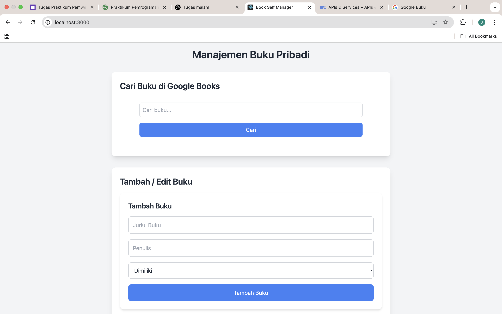
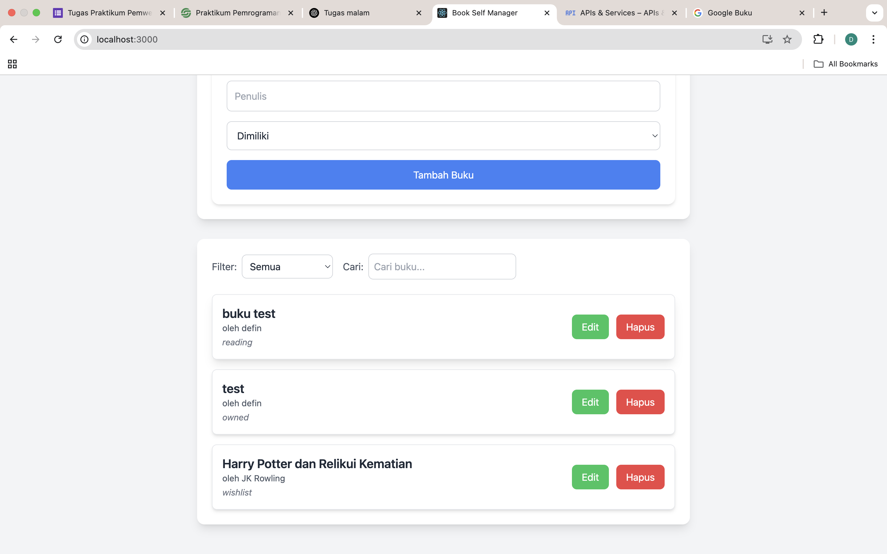
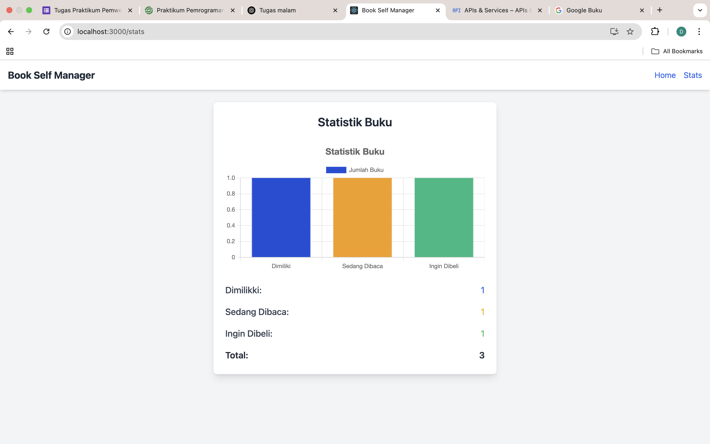

# 💻 Aplikasi Pemrograman Web – Pertemuan 3

## 🎯 Deskripsi Aplikasi

Aplikasi ini adalah proyek tugas untuk mata kuliah Pemrograman Web di **Institut Teknologi Sumatera (ITERA)**. Aplikasi ini dibangun menggunakan **React.js** dan digunakan untuk mempelajari dasar-dasar pengembangan aplikasi web interaktif. Proyek ini melibatkan pembuatan beberapa komponen, pengelolaan state, penggunaan React Router, dan penanganan event.

Proyek ini bertujuan untuk mengasah pemahaman dasar mengenai pengembangan aplikasi web dengan React dan praktik implementasi pemrograman web.

---
Screenshot Antarmuka






## ⚙️ Instruksi Instalasi dan Menjalankan


1. clone repositori
```bash
git clone https://github.com/Nachtt-2021/pemrograman_web_itera_121140022.git
3. Masuk ke Direktori Proyek
cd pemrograman_web_itera_121140022
4. Install Dependencies
npm install
5. Jalankan Aplikasi
npm start
Aplikasi akan berjalan di: http://localhost:3000

Fitur React yang Digunakan
Functional Component
Digunakan dalam semua bagian aplikasi agar ringan dan mudah dibaca.
useState & useEffect
const [products, setProducts] = useState([]);
useEffect(() => {
  fetchProducts();
}, []);
React Router v6

Navigasi antar halaman:
import { Routes, Route } from 'react-router-dom';

<Routes>
  <Route path="/" element={<Home />} />
  <Route path="/products" element={<Products />} />
  <Route path="/cart" element={<Cart />} />
</Routes>

Context API
Pengelolaan state global untuk keranjang belanja:
<CartContext.Provider value={{ cartItems, addToCart, removeFromCart }}>
  {children}
</CartContext.Provider>

Komentar dalam Kode
Komentar ditambahkan pada bagian-bagian penting dalam kode seperti:
// Fungsi untuk menambahkan produk ke cart
const addToCart = (product) => {
  setCartItems((prevItems) => [...prevItems, product]);
};

// Fungsi untuk menghapus produk dari cart berdasarkan ID
const removeFromCart = (id) => {
  setCartItems((prevItems) => prevItems.filter((item) => item.id !== id));
};
Komentar tambahan juga tersedia dalam file CartContext.js dan setiap komponen penting untuk memudahkan pemahaman.

🧪 Laporan Testing
Navigasi Halaman
Sudah diuji dan berjalan dengan baik tanpa reload antar halaman.

Add to Cart
Berhasil menambahkan produk ke keranjang dan tampil dinamis.

Hapus dari Cart
Tombol hapus produk bekerja dengan baik.

Responsif
Antarmuka diuji pada perangkat mobile dan tablet.

Bukti Screenshot Testing
Letakkan file screenshot di folder /screenshots.


📬 Kontak
Nama: Defin Surjaniah
NIM: 121140022
Email: defin@students.itera.ac.id
